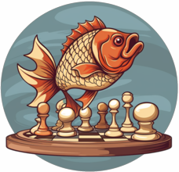

<div align="center">

  
</div>

# <div align="center"> Carp </div>

<div align="center">

  [![Build][build-badge]][build-link]
  [![License][license-badge]][license-link]
  [![Release][release-badge]][release-link]
  [![Commits][commits-badge]][commits-link]
  
  [![lichess-badge]][lichess-link]
  
</div>

Carp is a UCI-compatible didactic engine written in Rust, using a bitboard-based piece-centric approach.\
The engine is built on top of a conventional Negamax search and uses a simple NNUE evaluation.

The main goal of this project is to learn the basics of both Rust and Chess Programming.

## Rating Lists

| **Version** | [**CCRL 40/15**][ccrl-ltc-link] | [**CCRL BLITZ**][ccrl-blitz-link] | [**CEGT 40/4**][cegt-link] | [**MCERL**][mcerl-link] | [**IPMAN**][ipman-link] |
|-------------|----------------|-----------|-----------|-----------|-----------|
| 3.0.1       | 3502           | 3538      | 3430      | N/a       | 3301      | 
| 2.0.0       | 3087           | 3159      | 2980      | 3117      | N/a       | 
| 1.3.0       | N/a            | N/a       | N/a       | 2675      | N/a       | 
| 1.2.0       | N/a            | N/a       | N/a       | 2488      | N/a       | 
| 1.1.0       | N/a            | N/a       | N/a       | 2164      | N/a       | 

Carp is rigorously tested with SPRT, and is part of the [SWEHosting OB instance][ob-link].

## Project Structure & Building Carp

The workspace is structured in 4 main crates: **chess** is the game backend used by the engine,
**engine** is the UCI engine, **tools** is an executable with developer tools for training and datagen,
**wasm** is a WebAssembly shim to the engine (checkout its README for instructions).
The first two crates are designed to be dependency-less, although Syzygy Tablebase support requires
interfacing with [Fathom][fathom-link]. This is not compiled by default: make rules that enable it are
marked as **Syzygy**.

Building the base version of Carp only requires [Cargo][cargo-link]. Carp is currently tested on
Rust Stable **v1.87**, so that is the recommended version, although it could possibly work
(without guarantees) on earlier releases.\
Carp should work out-of-the-box on x86 Linux/Windows, aarch64 MacOS, and wasm32 targets.

For development, Carp can be ran through Cargo with ```cargo run --release --package engine```.\
Alternatively, a makefile is provided for ease of use, with the following rules:
* `make`: the default build, used by OpenBench.
* `make native` **[PGO,Syzygy]**: build an executable native to your machine.
* `make release-x86` **[PGO,Syzygy]**: build OS-specific  executables for all x86 [microarchitecture levels][arch-link].
* `make datagen` **[PGO,Syzygy]**: build the **tools** crate with data generation support.
* `make trainer`: build the **tools** crate with training support. Requires CUDA or HIP.

>**NOTE**: the builds marked with **PGO** require having *llvm-profdata*, which should be included with LLVM or CLANG.

## NNUE

Carp uses a (768->1024)x2->1 perspective net trained with Bullet.
It fully relies on its own self-play data for training the network. Viriformat data can be generated
with the utilities provided in the **tools** crate, processed via `bullet-utils` into bulletformat,
and used for training the network, again through **tools**.

As of Carp 2.0, NNUE has completely replaced the old HCE.

## Implemented optimizations

* Fully legal move generation (~435 MNodes/s on a 7950x) with Fixed Shift Black Magic Bitboards
* Fail-Hard Negamax + Quiescence
* Iterative Deepening with Aspiration Windows
* Move Ordering with a staged sorter:
  - MVV + Capture History with Threshold Static Exchange Evaluation
  - Quiet History
  - Continuation Histories
* Multithreading with Lazy-SMP
* Lockless Transposition table with aging
* Principal Variation Search
* Internal Iterative Reductions
* Late Move Reductions
* Null Move Pruning
* Reverse Futility Pruning
* Mate Distance Pruning
* History Leaf Pruning
* Extended Futility Pruning
* Late Move Pruning
* Singular Extensions
* Syzygy Endgame Tablebases

## Dependencies
None of these are strictly necessary to run the engine, but they are vital for development:

* [Fathom][fathom-link]
* [Cutechess-Cli](https://github.com/cutechess/cutechess)
* [Bullet](https://github.com/jw1912/bullet)
* [MarlinFlow](https://github.com/dsekercioglu/marlinflow)
* [OpenBench](https://github.com/AndyGrant/OpenBench)
* [Stockfish's WDL model](https://github.com/official-stockfish/WDL_model)

## Credits
* [CMK's chess engine in C series](https://www.youtube.com/watch?v=QUNP-UjujBM&list=PLmN0neTso3Jxh8ZIylk74JpwfiWNI76Cs)
* [Chess Programming Wiki](https://www.chessprogramming.org/Main_Page)
* Bruce Moreland's [Programming Topics](https://web.archive.org/web/20071026090003/http://www.brucemo.com/compchess/programming/index.htm)
* Cosmo, author of [Viridithas](https://github.com/cosmobobak/viridithas), for a lot of help with NNUE
* Crippa, author of [Svart](https://github.com/crippa1337/svart) for hosting the OB instance Carp is tested with.
* Johan, owner of [SWEHosting](https://swehosting.se/en/) for donating CPU time to our instance.
* Malu's [Asymptote](https://github.com/malu/asymptote) engine to better understand search heuristics
* The entire chess programming community, for countless awesome resources

[ob-link]:https://chess.swehosting.se/
[pgo-link]:https://en.wikipedia.org/wiki/Profile-guided_optimization
[cargo-link]:https://www.rust-lang.org/tools/install
[arch-link]:https://en.wikipedia.org/wiki/X86-64#Microarchitecture_levels
[ccrl-blitz-link]:https://computerchess.org.uk/ccrl/404/cgi/engine_details.cgi?print=Details&each_game=1&eng=Carp%203.0.1%2064-bit#Carp_3_0_1_64-bit
[ccrl-ltc-link]:https://computerchess.org.uk/ccrl/4040/cgi/engine_details.cgi?print=Details&each_game=0&eng=Carp%203.0.0%2064-bit%204CPU#Carp_3_0_0_64-bit_4CPU
[cegt-link]:http://www.cegt.net/40_4_Ratinglist/40_4_single/rangliste.html
[mcerl-link]:https://www.chessengeria.eu/mcerl
[ipman-link]:https://ipmanchess.yolasite.com/r9-7945hx.php
[movegen-link]:https://www.codeproject.com/Articles/5313417/Worlds-Fastest-Bitboard-Chess-Movegenerator
[fathom-link]:https://github.com/jdart1/Fathom

[build-badge]:https://img.shields.io/github/actions/workflow/status/dede1751/carp/build.yml?branch=main&logo=github&style=for-the-badge
[build-link]:https://github.com/dede1751/carp/actions/workflows/build.yml
[commits-badge]:https://img.shields.io/github/commits-since/dede1751/carp/latest?style=for-the-badge
[commits-link]:https://github.com/dede1751/carp/commits/main
[release-badge]:https://img.shields.io/github/v/release/dede1751/carp?style=for-the-badge&label=official%20release
[release-link]:https://github.com/dede1751/carp/releases/latest
[license-badge]:https://img.shields.io/github/license/dede1751/carp?style=for-the-badge&label=license&color=success
[license-link]:https://github.com/dede1751/carp/blob/main/LICENSE
[lichess-badge]:https://img.shields.io/badge/Play%20Carp%20-v3.0-yellow?logo=lichess&style=for-the-badge
[lichess-link]:https://lichess.org/@/Carp_Bot
